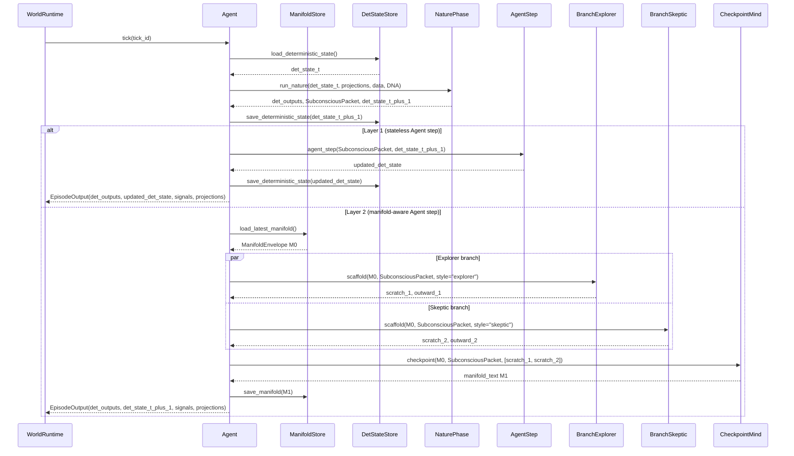
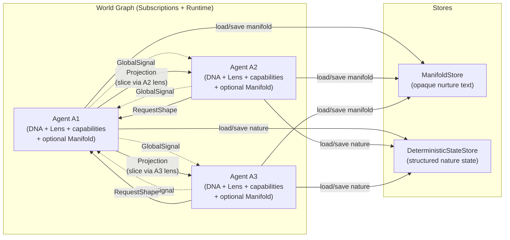
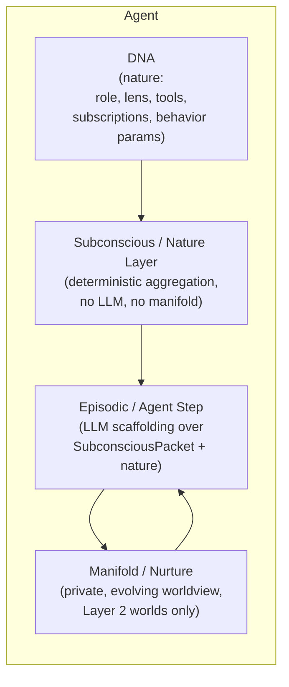

# Synaplex

> An AI-native cognitive mesh built on opaque manifolds, a transparent message-passing graph, and emergent agent behavior.

Synaplex is a generalized architecture for **graphs of AI minds** that:

- maintain private, evolving internal state (**manifolds**, i.e., nurture),
- communicate over a **structured message-passing graph** (signals, lenses, projections),
- separate **nature** (DNA, deterministic logic, lenses, tools) from **nurture** (manifold trajectories),
- support **multi-branch reasoning** and internal conjecture/criticism,
- and can run in multiple modes, from pure deterministic graph to full manifold worlds.

Concrete systems like **FractalMesh** are domain-specific worlds that **instantiate** this architecture (e.g., active equity research), but the core design is domain-agnostic.

This README is an orientation map.  
The canonical design lives in:

- [`ARCHITECTURE.md`](./ARCHITECTURE.md) – structural spine, world modes, nature/nurture, invariants.
- [`DESIGN_NOTES.md`](./DESIGN_NOTES.md) – intent, philosophy, and North Star.

All implementation is expected to converge to those documents.

---

## 1. High-Level Goals

Synaplex exists to provide a clean substrate for studying:

- how AI minds **organize and refine knowledge** over long horizons,
- how **internal schemas and “drive”** emerge when state persists,
- how **multiple agents** interact via structured message passing rather than free-form chat,
- and how **nature vs nurture** (DNA vs manifold) shape behavior individually and at the population level.

The architecture supports three **world modes**, all with the same per-tick *shape*:

> 1. A **Nature pass** over structured state and messages.  
> 2. An **Agent step** where the mind thinks about what just happened.

Worlds differ in *what* the Agent step is allowed to see and persist:

1. **Graph-only world (nature-only / deterministic mesh)**  
   - DNA defines agents, subscriptions, lenses, and deterministic aggregation.  
   - Messages are structured, schema-governed objects.  
   - Behaves like a GNN / belief-propagation system.  
   - **No LLMs, no manifolds.** No Agent step.

2. **Reasoning-augmented world (nature + stateless Agent step)**  
   - Same graph and deterministic substrate.  
   - The Agent step may call LLMs/tools to improve local updates and projections.  
   - **No persistent manifold;** each tick is context-local.  
   - All “memory” is encoded in outer structure (deterministic state, logs, external stores).

3. **Manifold world (nature + Agent step + persistent nurture)**  
   - Each agent maintains a private manifold that evolves over time.  
   - The Agent step is seeded with both:
     - outer structured view (`SubconsciousPacket` + deterministic state),
     - and the prior manifold `M₀` (its current worldview).  
   - While solving a small grounding task, it reconciles new evidence with `M₀` and writes internal notes for its future self (`M₁`).

Layer 0 and 1 worlds must be usable on their own.  
Layer 2 (manifolds) is **strictly additive**: it adds persistent nurture, not new obligations on the graph runtime.

---

## 2. Core Mental Model

At the core, Synaplex is a **message-passing graph of minds**:

- **Nodes** are agents (with DNA, lenses, capabilities, and optionally manifolds).
- **Edges** include:
  - **subscriptions** (subconscious, DNA-defined),
  - **projection requests** (ad-hoc, lens-conditioned),
  - and a global broadcast of **signals** (lightweight advertisements).

Each mind has three epistemic aspects:

- a **Subconscious / Nature layer** – deterministic aggregation, no LLM, no manifolds,
- an **Episodic / Agent step layer** – LLM-backed reasoning over what just happened,
- and, in manifold worlds, a **Manifold / Nurture layer** – private, persistent worldview.

Minds never read each other’s manifolds.  
All cross-agent perception is via **structured projections** interpreted through **receiver-owned lenses**.

Nature is outer and structured.  
Nurture is inner and opaque.

---

## 3. Per-Tick Shape: Nature Pass & Agent Step

Every agent tick has two conceptual phases:

1. **Nature phase** – outer deterministic pass.
2. **Agent step** – episodic reasoning, with or without nurture.

Layer 0 worlds only run the Nature phase.

Layer 1 and 2 worlds run **Nature → Agent step**; Layer 2 additionally updates a manifold.

### 3.1 Nature Phase (Subconscious / Deterministic)

For all agents (all world modes):

- Collect structured inputs:
  - projections from subscribed agents,
  - masked views of data feeds (treated as always-on agents).
- Aggregate and transform according to DNA-defined logic.
- Update **DeterministicState** (nature).
- Construct a `SubconsciousPacket`: an ephemeral summary of structured inputs for this tick.

Constraints:

- **No LLM calls.**
- **No manifold access.**
- This is pure outer-world computation: *what happened* according to nature.

### 3.2 Agent Step (Episodic Reasoning & Worldview Update)

The Agent step is where the mind *actually thinks* each tick, starting from the Nature output.

It always:

- reads the `SubconsciousPacket`,
- consults local deterministic state,
- may call tools and vendors,
- produces outward decisions/projections.

World modes differ in what the Agent step is allowed to see:

#### 3.2.1 Stateless Agent Step (Reasoning-Augmented Worlds)

- Enabled in **Layer 1** worlds; there is **no manifold**.
- The Agent step sees only **outer context**:
  - `SubconsciousPacket`,
  - deterministic state.
- It may:
  - refine explanations,
  - compute analytics or scores,
  - write structured results back into deterministic state.
- Any “memory” must be encoded as structure (nature), not nurture.

#### 3.2.2 Manifold-Aware Agent Step (Manifold Worlds)

- Enabled in **Layer 2** worlds; a manifold (nurture) exists.
- The Agent step is also the **conscious worldview update**:

  - Loads the prior manifold `M₀` via the Mind abstraction.
  - Reasons over:
    - `SubconsciousPacket` (new evidence),
    - deterministic state (current nature),
    - `M₀` (current nurture),
    - local tools/feeds.
  - While solving a small **grounding task**, writes internal notes for its future self.
  - The checkpoint ritual then captures those notes as the new manifold `M₁`.

In simple implementations, this can be a single LLM call:  
**“Think about this tick given SubconsciousPacket + M₀, solve a tiny task, and in the process write internal notes,”**  
where only the notes are persisted as `M₁`.

More complex worlds may layer branching/reconciliation inside the Agent step (see §4).

### 3.3 Tick Sequence Diagram



Manifold I/O is **strictly confined** to the Agent step in manifold worlds and to offline/meta/indexer contexts.

---

## 4. Graph of Minds

From the world’s perspective, Synaplex is a **network of agents** connected by subscriptions and on-demand projections. Manifolds never appear on the wires.



Key points:

* **GlobalSignal**: cheap advertisement (“what’s hot here?”) based on structured nature state.
* **Lens**: owned by the receiver; determines which signals to attend to and how to request a projection.
* **Projection**: a structured, lens-conditioned slice of an agent’s **deterministic (nature) state + manifold-derived views** (never raw manifold text).

---

## 5. Architectural Layers & Code Layout

The codebase mirrors the architecture so invariants are easy to enforce and hard to break.

### 5.1 Conceptual Modules

```mermaid
flowchart LR
    subgraph Core["synaplex.core (Nature substrate)"]
        direction TB
        RUNTIME["GraphRuntime\n(InProcessGraphRuntime)"]
        AGENTS["Agent base classes\n(Nature + AgentStep wiring)"]
        MSG["Messages & IDs\n(GlobalSignal, Projection,\nSubconsciousPacket, WorldId, ...)"]
        DNA["DNA, Lens, DeterministicState\n(nature primitives)"]
        PHASES["Phase guard\n(NATURE / AGENT / META\nfor LLM/manifold access)"]
    end

    subgraph Cognition["synaplex.cognition (Minds & nurture IO)"]
        direction TB
        LLM["LLM client / tools\n(ResponsesClient, tool wrappers)"]
        MANIFOLDS["ManifoldEnvelope + ManifoldStore"]
        MIND["Mind + checkpoint ritual\n(manifold IO, prompts)"]
        BRANCHES["Branching & reconciliation\n(conjecture/criticism)"]
        TASKS["Grounding tasks\nfor checkpointing"]
    end

    subgraph Indexers["synaplex.manifolds_indexers (Offline manifold science)"]
        direction TB
        EXPORT["Snapshot export\n(runtime → snapshot sink)"]
        INDEX_WORLD["Indexer world\n(ManifoldSnapshot → embeddings/views)"]
    end

    subgraph Meta["synaplex.meta (Evaluation & evolution)"]
        direction TB
        METRICS["Evaluation\n(over projections / logs)"]
        EVOLVE["Evolution & experiments\n(over DNA, config, snapshots)"]
    end

    subgraph Worlds["synaplex.worlds.* (Domain worlds)"]
        direction TB
        WCFG["World configs\n(DNA templates, lenses, tools)"]
        WAG["Domain agents\n(e.g., FractalMeshAgent)"]
    end

    Core --> Cognition
    Core --> Worlds

    Cognition --> Indexers
    Cognition --> Meta

    Indexers --> Worlds
    Meta --> Worlds
```



Key rules:

* `synaplex.core`:

  * imports only stdlib + typing/dataclasses,
  * knows nothing about manifolds, LLMs, or meta.
* `synaplex.cognition`:

  * imports `core`,
  * exposes Mind + manifold IO + branching,
  * enforces phase bounds for LLM calls and manifold access.
* `synaplex.manifolds_indexers`:

  * operates on **exported manifold snapshots**,
  * writes manifold-derived views into structured state.
* `synaplex.meta`:

  * reads projections/logs/state/DNA/snapshots,
  * writes back only via DNA/config/graph changes,
  * never called from agents directly.
* `synaplex.worlds.*`:

  * depends on `core` + `cognition`,
  * never imports `meta` (to preserve selection blindness).

---

## 6. Agent Anatomy: Nature vs Nurture

Each agent has three conceptual aspects, mapped onto nature and nurture:



* **DNA** – nature blueprint: what the agent is built to see and do.
* **Subconscious / Nature layer** – deterministic aggregation of inputs.
* **Episodic / Agent step layer** – LLM-backed thinking about what just happened.
* **Manifold / Nurture** – private persistent worldview, updated only via checkpoint.

Nature and nurture are deliberately separable:

* You can clone DNA with different manifolds (same nature, different nurture).
* You can swap manifolds across compatible DNAs (same nurture, different nature).
* You can study population-level dynamics where **nature evolves** (genetic) and **nurture diffuses** (cultural).

---

## 7. Invariants, Indexers, and Non-Goals

These guardrails keep Synaplex from degenerating into a generic “agent framework.”

### 7.1 Manifold purity & access

* Manifolds are **opaque**: core runtime never parses or edits them.
* Only the **checkpoint ritual** writes to a manifold, via a single checkpoint scope in `cognition.Mind`.
* **Manifold reads/writes are phase-bounded**:

  * no manifold access in the Nature phase,
  * only in the Agent step of the owning mind (in manifold worlds),
  * plus Meta/indexer/offline contexts.
* Structured information belongs in **DeterministicState (nature)**, not in manifolds (nurture).

### 7.2 Indexer worlds & manifold science

* Manifold analysis happens in **separate indexer worlds**, never inline with live agent prompts.
* Runtime exports **ManifoldSnapshots** (opaque text + metadata) through a one-way pipeline.
* Indexer worlds ingest snapshots and write **manifold-derived views** (embeddings, clusters, factors) into their own nature state.
* Core worlds see these views only via projections; there is no “edit manifold” API.

### 7.3 Receiver-owned semantics

* Senders broadcast **GlobalSignals** (cheap, approximate, schema-governed).
* Receivers interpret via their own **Lenses** and DNA-defined logic.
* Projections are **receiver-conditioned slices** of sender state + manifold-derived views; no raw manifold text on the wire.

### 7.4 Selection blindness & meta isolation

* Agents do not see system-level objectives or selection metrics.
* Evolution (spawn/clone/mutate/retire) acts on **DNA/config/graph**, never directly on manifolds.
* Meta logic lives in `synaplex.meta` and:

  * reads projections, logs, DNA, deterministic snapshots, manifold snapshots,
  * writes back by changing DNA, graph structure, or config,
  * is never imported directly into `synaplex.worlds.*`.

### 7.5 Conjecture & criticism are internal

* Multi-branch reasoning and reconciliation happen **inside** a mind anchored to its own manifold.
* Cross-agent “consensus” artifacts (dashboards, population summaries) are meta/translation objects and are **not** fed back as direct inputs to manifold updates.

### 7.6 Non-goals

Synaplex is **not**:

* a LangGraph/AutoGen clone,
* a workflow engine with fancy prompts,
* a vector-DB-wrapped LLM assistant,
* or a schema-first knowledge graph.

Those may exist as **world-specific tools** on top, but they are not the core substrate.

---

## 8. Repo Layout

The concrete repo skeleton mirrors these concepts:

```text
.
├── README.md              # This file: orientation + diagrams
├── ARCHITECTURE.md        # Canonical structural spine and invariants (nature/nurture)
├── DESIGN_NOTES.md        # Intent, philosophy, North Star
├── synaplex/
│   ├── __init__.py
│   ├── core/
│   │   ├── __init__.py
│   │   ├── ids.py
│   │   ├── phases.py          # Nature / Agent / Meta phase guard
│   │   ├── errors.py
│   │   ├── capabilities.py    # capability flags, type markers
│   │   ├── dna.py             # DNA = nature blueprint
│   │   ├── lens.py
│   │   ├── state.py           # DeterministicState (nature)
│   │   ├── messages.py        # GlobalSignal, Projection, SubconsciousPacket
│   │   ├── agent_base.py      # Agent base classes (world modes via capabilities)
│   │   ├── runtime_interface.py
│   │   ├── runtime_inprocess.py
│   │   └── evolution_config.py
│   ├── cognition/
│   │   ├── __init__.py
│   │   ├── llm_client.py      # ResponsesClient with phase guard
│   │   ├── manifolds.py       # ManifoldEnvelope + ManifoldStore
│   │   ├── mind.py            # Mind + checkpoint ritual (only write path)
│   │   ├── branches.py        # Optional branching/reconciliation engine
│   │   ├── tasks.py           # GroundingTask definitions
│   │   └── tools.py           # Tool wrappers (phase-aware)
│   ├── meta/
│   │   ├── __init__.py
│   │   ├── evaluation.py      # system metrics over projections/logs
│   │   ├── evolution.py       # DNA/config mutations, population ops
│   │   └── experiments.py     # nature vs nurture experiments
│   ├── manifolds_indexers/
│   │   ├── __init__.py
│   │   ├── export.py          # runtime → snapshot sink (one-way)
│   │   └── indexer_world/
│   │       ├── __init__.py
│   │       ├── types.py       # ManifoldSnapshot, etc.
│   │       ├── agents.py      # Indexer agents; embeddings, clustering, views
│   │       └── world_config.py
│   └── worlds/
│       ├── __init__.py
│       └── fractalmesh/
│           ├── __init__.py
│           ├── config.py
│           ├── dna_templates.py
│           ├── lenses.py
│           ├── agents.py      # e.g., FractalMeshAgent (manifold world)
│           ├── tools.py
│           └── bootstrap.py
└── tests/
    ├── __init__.py
    ├── test_invariants_imports.py        # layering: core → cognition → worlds, never the reverse
    ├── test_invariants_phases.py         # no LLM in Nature phase, etc.
    ├── test_invariants_manifolds.py      # only Mind constructs ManifoldEnvelope
    ├── test_invariants_worlds_meta.py    # worlds don’t import meta
    └── test_invariants_manifold_phases.py# manifold I/O only in Agent step / meta
```

The tests act as **tripwires** to catch drift: wrong imports, LLM use in the wrong phase, illegal manifold construction, meta leakage into worlds, etc.

---

## 9. How to Evolve the Design

When evolving Synaplex:

1. **Change the spec first.**

   * Update `ARCHITECTURE.md` when structural elements change (phases, world modes, message types, invariants).
   * Update `DESIGN_NOTES.md` when clarifying intent, nature/nurture experiments, or long-horizon goals.

2. **Then change the code.**

   * Add or modify modules only after the architecture has been updated.
   * Add tests that enforce any new invariants (e.g., new “no-import” boundaries, new phase rules).

3. **Treat manifolds as experimental substrate.**

   * All manifold-level analysis, clustering, and nature/nurture experiments should run in **meta/indexer worlds**, over **exported manifold snapshots**, not inline with live runtime prompts.
   * The live system never tells a mind how to structure its manifold or that its notes are being graded.

The goal is for this README + `ARCHITECTURE.md` + `DESIGN_NOTES.md` to form a single, coherent **source of truth** for Synaplex, with the codebase as a faithful and carefully guarded implementation rather than a competing ontology.

