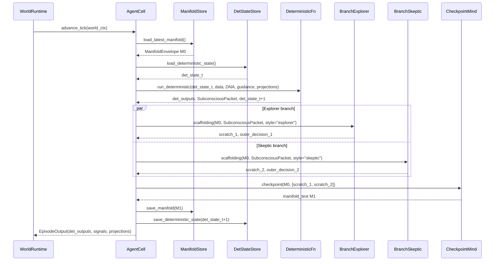
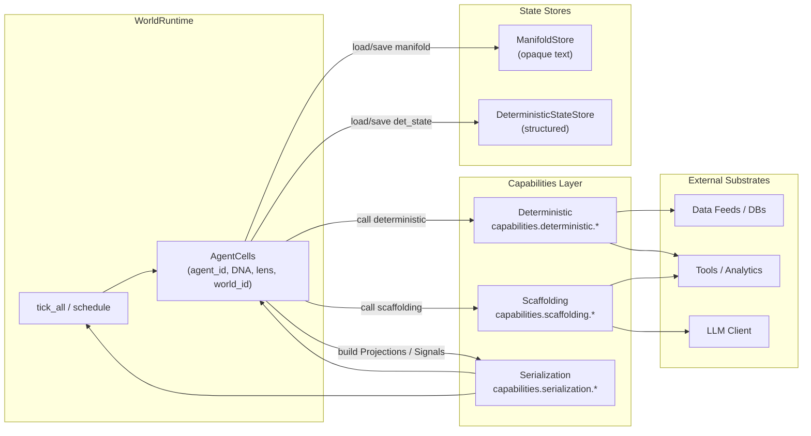
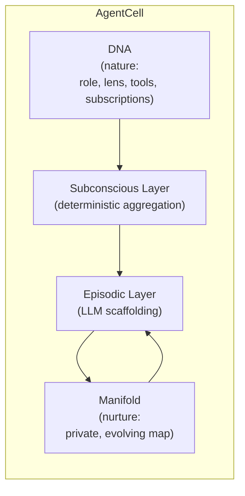

# Synaplex

> An AI-native cognitive mesh built on opaque manifolds, a transparent message-passing graph, and emergent agent behavior.

Synaplex is a generalized architecture for **graphs of AI minds** that:

- maintain private, evolving internal state (**manifolds**),
- communicate over a **structured message-passing graph** (signals, lenses, projections),
- separate **nature** (DNA, deterministic logic, lenses, tools) from **nurture** (manifold evolution),
- support **multi-branch reasoning** and internal conjecture/criticism,
- and can run in multiple modes, from pure deterministic graph to full manifold worlds.

Concrete systems like **FractalMesh** are domain-specific worlds that **instantiate** this architecture (e.g., active equity research), but the core design is domain-agnostic.

This README is an orientation map.  
The canonical design lives in:

- [`ARCHITECTURE.md`](./ARCHITECTURE.md) – structural spine and invariants.
- [`DESIGN_NOTES.md`](./DESIGN_NOTES.md) – intent, philosophy, and North Star.

All implementation must converge to those documents.

---

## 1. High-Level Goals

Synaplex exists to provide a clean substrate for studying:

- how AI minds **organize and refine knowledge** over long horizons,
- how **internal schemas and “drive”** emerge when state persists,
- how **multiple agents** interact via structured message passing rather than free-form chat,
- and how **nature vs nurture** (DNA vs manifold) shape behavior.

The architecture is deliberately layered so that it can operate in three modes:

1. **Graph-only layer (deterministic mesh)**  
   - DNA defines agents, subscriptions, lenses, and deterministic aggregation.  
   - Messages are structured, schema-governed objects.
   - Behaves like a GNN / belief-propagation system.  
   - No LLMs, no manifolds.

2. **Reasoning-augmented layer (stateless cognition)**  
   - Same graph and deterministic substrate.  
   - Agents may call LLMs/tools to improve local updates and projections.  
   - No persistent manifold; each tick is context-local.

3. **Manifold layer (persistent inner life)**  
   - Each agent maintains a private manifold that evolves over time.  
   - Manifold encodes what the agent finds salient, unexplained, or worth revisiting.  
   - Provides a foothold for **learning-like behavior**, better explanations, and emergent drive.

Layers 0 and 1 must be usable on their own.  
Layer 2 (manifolds) is **strictly additive**: it adds persistence and richness, not new obligations.

---

## 2. Core Mental Model

At the core, Synaplex is a **message-passing graph of minds**:

- **Nodes** are agents (with DNA, lenses, capabilities, and optional manifolds).
- **Edges** include:
  - **subscriptions** (subconscious, DNA-defined),
  - **projection requests** (ad-hoc, lens-conditioned),
  - and a global broadcast of **signals** (lightweight advertisements).
- Each agent has:
  - a **Subconscious / deterministic layer** (no LLMs),
  - an **Episodic / scaffolding layer** (LLM + tools),
  - and, in manifold worlds, a **Manifold layer** (private, persistent state).

Minds never read each other’s manifolds.  
All cross-agent perception is via **structured projections** interpreted through receiver-owned lenses.

---

## 3. Agent Lifecycle (Per-Tick)

The canonical per-agent tick has three epistemic phases:

1. **Subconscious / deterministic phase**  
   - Collects structured inputs (projections, data feeds).  
   - Aggregates and transforms them according to DNA-defined logic.  
   - Produces a `SubconsciousPacket` for this tick.  
   - No LLM calls; no manifold access.

2. **Conscious / scaffolding phase**  
   - Reads the `SubconsciousPacket`.  
   - Reads the prior manifold (if enabled).  
   - Runs one or more **scaffolding branches** (different “personalities”) using LLM + tools.  
   - Produces scratch reasoning and outward-facing decisions/projections.

3. **State update / checkpoint ritual**  
   - A checkpoint mind is seeded with:
     - the prior manifold, and
     - branch scratch / candidate notes,
     in a way that does *not* explicitly ask it to “summarize” or “clean up” its notes.  
   - It performs a simple grounding task and **opportunistically captures** new internal notes for its future self.  
   - The output becomes the new manifold.

A sequence diagram capturing this flow:



Details of prompts, grounding tasks, and branch styles are specified in `ARCHITECTURE.md` and can evolve, but the **phase separation** must be preserved.

---

## 4. Graph of Minds

From the world’s perspective, Synaplex is a **network of agents** connected by subscriptions and on-demand projections. Manifolds never appear on the wires.

```mermaid
flowchart LR
    subgraph World["World Graph (Subscriptions + Runtime)"]
        direction LR
        A1["Agent A1<br>(DNA + Lens + Manifold)"]
        A2["Agent A2<br>(DNA + Lens + Manifold)"]
        A3["Agent A3<br>(DNA + Lens + Manifold)"]
    end

    subgraph Stores["Stores"]
        MStore["ManifoldStore<br>(opaque text)"]
        DStore["DeterministicStateStore<br>(structured)"]
    end

    %% State links
    A1 -->|load/save manifold| MStore
    A2 -->|load/save manifold| MStore
    A3 -->|load/save manifold| MStore

    A1 -->|det_state| DStore
    A2 -->|det_state| DStore
    A3 -->|det_state| DStore

    %% Global signals (broadcast-ish)
    A1 -. GlobalSignal .-> A2
    A1 -. GlobalSignal .-> A3
    A2 -. GlobalSignal .-> A1
    A3 -. GlobalSignal .-> A1

    %% Projections (lens-conditioned requests)
    A2 -->|RequestShape| A1
    A1 -->|Projection<br>(slice via A2 lens)| A2

    A3 -->|RequestShape| A1
    A1 -->|Projection<br>(slice via A3 lens)| A3
```

Key points:

* **GlobalSignal**: cheap advertisement (“keys”) about what’s currently hot or changed.
* **Lens**: owned by the receiver; determines which signals to attend to and how to request a Projection.
* **Projection**: a structured, lens-conditioned slice of an agent’s **deterministic state + safe views** of its scaffolds.
  Manifolds are never exposed directly.

---

## 5. Architectural Layers

The implementation is organized into layers to keep invariants enforceable:



* Deterministic code lives under `capabilities.deterministic.*` and must have **no LLM calls**.
* Scaffolding lives under `capabilities.scaffolding.*` and may call LLM + tools.
* Serialization builds `GlobalSignal`, `Projection`, etc., from agent state.
* Manifolds are persisted as opaque text in `ManifoldStore`; no runtime component parses them.

---

## 6. Agent Anatomy: Nature vs Nurture

Each agent has three conceptual aspects:



* **DNA**: what the agent is built to see and do (nature).
* **Subconscious layer**: deterministic aggregation of inputs (no LLM).
* **Episodic layer**: deliberate reasoning (LLM + tools).
* **Manifold**: private, persistent map and evolving sense of what matters (nurture).

Nature and nurture remain **separable** so you can:

* clone DNA with different manifolds,
* swap manifolds between compatible DNAs,
* run nature vs nurture experiments in sandbox worlds.

---

## 7. Invariants and Non-Goals

A small set of invariants keeps the system from drifting into “yet another agent framework”:

* **Manifold purity**

  * Manifolds are opaque; runtime never parses or edits them.
  * Only the checkpoint ritual writes to the manifold.
  * Structured information belongs in deterministic state, not in manifolds.

* **Phase separation**

  * Deterministic phase has no LLM calls and no manifold access.
  * Scaffolding may use LLM + tools but treats deterministic outputs as ground truth and manifold as private notes.
  * Checkpoint is the only place where manifold persistence is updated.

* **Receiver-owned semantics**

  * Senders broadcast global signals.
  * Receivers interpret via their own lenses.
  * Projections are lens-conditioned slices; no raw manifold sharing.

* **Selection blindness**

  * Agents do not see system-level objectives or selection metrics.
  * Evolution (spawn/clone/mutate/retire) acts on DNA/config, not directly on manifolds.

* **Conjecture & criticism are internal**

  * Multi-branch reasoning and reconciliation happen *inside* an agent anchored to its own manifold.
  * Cross-agent “consensus” objects (population summaries, dashboards) are meta/translation artifacts and are **not** fed back as direct inputs to manifold updates.

This architecture is **not**:

* a LangGraph/AutoGen clone,
* a workflow engine with fancy prompts,
* a vector-DB-wrapped LLM assistant,
* or a schema-first knowledge graph.

Those may exist as **world-specific tools** on top, but they are not the core substrate.

---

## 8. Repo Layout (Planned)

A minimal starting structure:

```text
.
├── README.md              # This file: orientation + diagrams
├── ARCHITECTURE.md        # Canonical structural spine and invariants
├── DESIGN_NOTES.md        # Intent, philosophy, North Star
├── docs/
│   └── diagrams/
│       ├── agent_tick.mmd
│       ├── world_graph.mmd
│       ├── architecture_layers.mmd
│       └── agent_anatomy.mmd
├── synaplex/
│   ├── world_runtime/     # WorldRuntime, scheduling, wiring
│   ├── capabilities/
│   │   ├── deterministic/
│   │   ├── scaffolding/
│   │   └── serialization/
│   ├── stores/
│   │   ├── manifold_store/
│   │   └── deterministic_store/
│   └── infra/
│       ├── llm_client/
│       └── tools/
└── worlds/
    └── fractalmesh/       # Example domain world (optional at start)
```

File names for the diagrams can be adjusted; the mermaid code in this README can be copied into `.mmd` files under `docs/diagrams/`.

---

## 9. How to Evolve the Design

When evolving the system:

1. **Change ARCHITECTURE/DESIGN first.**

   * Update `ARCHITECTURE.md` when you add or change structural elements.
   * Update `DESIGN_NOTES.md` when you clarify intent, invariants, or long-horizon goals.

2. **Only then modify code.**

   * New modules, capabilities, or runtime changes should reference the relevant sections of `ARCHITECTURE.md`.
   * Tests should enforce the invariants described there (e.g., no LLM calls in deterministic modules).

3. **Treat manifolds as experimental substrate.**

   * All manifold-level analysis, clustering, and nature/nurture experiments should be done in sandbox/meta space, not inline with live runtime.

The goal is for this README + `ARCHITECTURE.md` + `DESIGN_NOTES.md` to act as the **one true source of truth** for the design, with code as a faithful implementation rather than a competing ontology.

