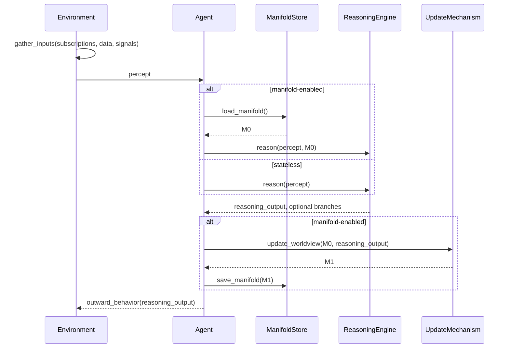
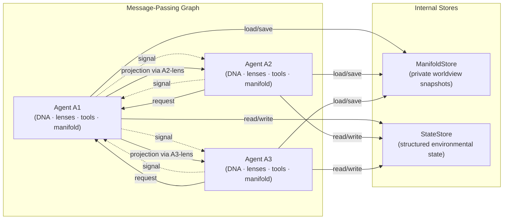
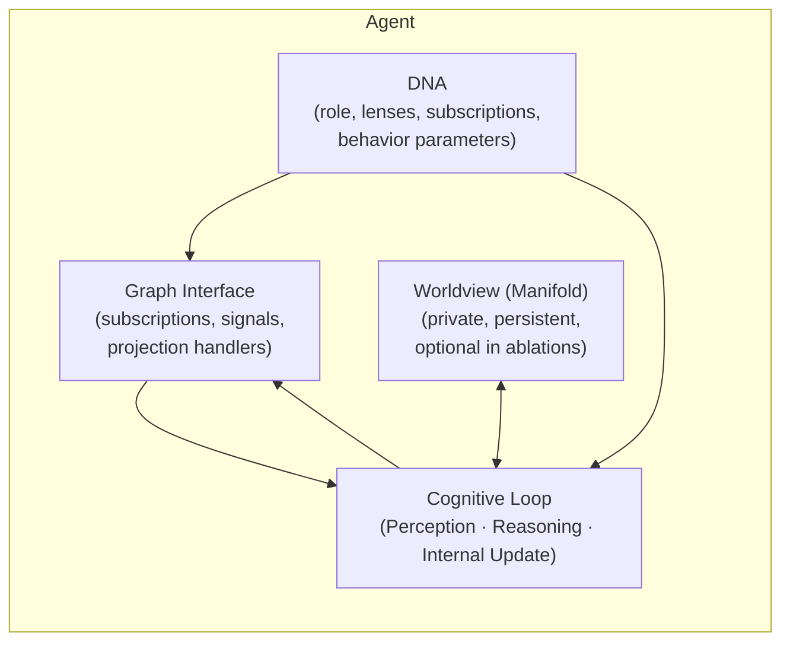

# Synaplex

> Synaplex is an architecture for AI systems made of many interacting minds. Each mind maintains its own internal worldview while coordinating through a structured graph of messages.

Synaplex provides a single pattern for organizing such systems:

* multiple minds maintain **their own internal state** while sharing the same exterior world,
* interaction flows through a **structured message graph** that shapes what each mind can perceive and act on,
* the system distinguishes built-in structural constraints (nature) from learned internal organization (nurture) because they play different methodological roles, while leaving open how strictly or loosely that separation should manifest in implementation,
* minds may run **internal reasoning routines**—branching, conjecture, critique—when interpreting what they receive,
* and the same runtime structure can be used with or without the full cognitive loop enabled, allowing for ablation studies ranging from deterministic graph-only execution to full LLM-native, manifold-driven cognition.

Concrete “worlds” are simply domain-specific configurations of this architecture: they define their own DNA, lenses, tools, and agent roles. The core design remains fully domain-agnostic.

---

## 1. High-Level Goals

Synaplex exists to provide a clean substrate for studying how distributed AI minds develop, interact, and evolve when they each maintain an internal worldview.

More concretely, the architecture is designed to explore:

* how minds **organize and refine internal representations** over long horizons without collapsing them into human-readable summaries,
* how **self-generated internal worldviews** emerge when an agent’s internal state persists and influences its future reasoning,
* how agents interact in a **non-hierarchical graph**, where perspective depends on where you stand and no node is intrinsically central,
* how **perception** arises from structured message passing—both passive flows (subscriptions) and active information-seeking,
* how **nature** (graph structure, DNA, lenses) and **nurture** (the evolving internal state) jointly shape behavior,
* how internal reasoning—branching, conjecture, criticism, reconciliation—can occur *within* a mind without collapsing its internal representation,
* and how populations of agents exhibit **cultural drift, evolutionary dynamics, and counterfactual behavior** when their worldviews interact indirectly through the graph.

The runtime exposes a unified cognitive loop:

> **Perception → Reasoning → Internal Update**

World configurations simply **disable or truncate later steps** for experimentation.
They do **not** represent different ontologies.

Configurations differ only in which parts of the loop are enabled:

1. **Graph-only world**

   * Only the perception step is active (deterministic aggregation via DNA).
   * No reasoning, no persistent internal state.

2. **Reasoning-augmented world**

   * Perception + reasoning.
   * No internal worldview is maintained.

3. **Manifold world**

   * Full loop: perception, reasoning, and persistent internal update.

These modes are **scaffolds**, not commitments.
The manifold’s structure is deliberately unconstrained so the system can observe how internal worldviews emerge, diversify, and influence behavior.

---

## 2. Core Mental Model

At its core, Synaplex is a **network of LLM-native minds** that each maintain an evolving internal worldview and interact through structured message passing.
The graph provides the external environment; the minds provide the cognition.

Within this network:

* **Nodes** are agents defined by their structural blueprint (DNA), their perceptual transformations (lenses), their tools, and their evolving internal state.
* **Edges** represent information flow:

  * **subscriptions** — stable, always-on inputs,
  * **active requests** — directed information-seeking,
  * **signals** — lightweight broadcasts that advertise aspects of a mind’s state.

Each mind follows a unified cognitive loop:

1. It **perceives** the information available to it through its lenses.
2. It **reasons** using its LLM-backed capabilities—exploring hypotheses, critiquing assumptions, or seeking additional evidence.
3. It **updates** its internal worldview (the manifold) when persistent state is enabled.

The manifold is the mind’s **private, persistent representation of its evolving understanding**—not a database, schema, or cache, but an internal cognitive substrate optimized for its own future versions.
Other agents never access it directly; all perception of other minds flows through **structured projections** interpreted via the receiver’s lenses.

This establishes a strict boundary:

* **Nature** is the shared external structure that constrains perception and interaction: the graph, DNA, lenses, and deterministic state.
* **Nurture** is the mind’s internal cognitive trajectory: its manifold, its reasoning patterns, and its evolving worldview.

Nature organizes what a mind can see.
Nurture organizes what a mind can become.

---

## 3. Per-Tick Cognitive Loop

Each tick represents one cycle of interaction between a mind and its environment.
The system does not divide cognition into stacked layers. Instead, every agent follows a **unified loop** with three functional roles:

1. **Perception** – the environment produces a structured view of what is visible to the agent.
2. **Reasoning** – the agent interprets what it perceives, explores possibilities, and may request additional information.
3. **Internal Update** – the agent revises its internal worldview (the manifold) based on its reasoning.

World modes only determine which parts of this loop are active in a given experiment.
World modes only deactivate parts of the loop; they do not introduce new cognitive ontologies.

---

### 3.1 Perception (Environment → Mind)

The environment gathers inputs according to DNA-defined structure:

* projections from subscribed agents,
* structured data feeds,
* signals broadcast on the graph.

These are compiled into a **percept**, a structured representation of what the agent can see through its lenses.

No LLM calls occur here, and the agent’s internal worldview is not involved.

---

### 3.2 Reasoning (Mind → Mind / Environment)

The mind interprets its percept using LLM-powered cognition.
It may:

* refine or critique its understanding,
* explore multiple hypotheses,
* identify information gaps,
* issue directed requests,
* generate outward signals or projections.

Branching styles (e.g., “explorer,” “skeptic”) represent internal cognitive variation.

All outward behavior originates here.

---

### 3.3 Internal Update (Mind → Manifold)

If persistent internal state is enabled, the mind updates its worldview.

This update may:

* reconcile new evidence,
* integrate insights from branching,
* reorganize or enrich latent structures,
* capture contradictions or unresolved questions for future iterations.

Only future instances of the same mind access this state.

---

### 3.4 Unified Tick Flow

> **Perception → Reasoning → Internal Update**

World modes simply truncate this sequence.

---

### 3.5 Tick Sequence Diagram



This reflects:

* a single cognitive loop,
* deterministic preprocessing in the environment,
* reasoning as the center of gravity,
* manifold updates as optional but intended for full cognition.

---

## 4. Graph of Minds

Synaplex is a **message-passing graph of minds**, where each mind maintains its own evolving worldview while participating in a shared external structure.
The graph defines *who can see what*, *when*, and *in what transformed form*.
The minds define *how they think about what they see*.

Communication happens entirely through **structured, lens-conditioned projections and signals**.
A mind’s private worldview—the manifold—never leaves the mind that owns it.



---

## 4.1 Subscriptions: Always-On Perception

Some edges in the graph are **subscriptions**:
long-lived, structural connections defined by an agent’s DNA.

If A2 subscribes to A1, then on every tick:

1. A1 produces a *projection* of its state **as perceived through A2’s lens**.
2. A2 receives this transformed view as part of its percept.
3. A1 remains unaware of how its state was transformed or interpreted.

Subscriptions define the *passive perceptual field* of each mind.
The receiver’s lens—not the sender’s internal representation—defines the meaning of the projection.

---

## 4.2 Signals: What a Mind Advertises About Itself

A **signal** is a lightweight broadcast emitted by an agent to the entire graph.

You can think of signals as **attentional keys**:

* small, distilled indicators of “what’s happening here,”
* not summaries of the agent’s worldview,
* not collapsed representations,
* just *hooks* that receiving agents can choose to attend to.

Agents decide which signals matter using their lenses.

No worldview content is ever leaked through signals.

---

## 4.3 Active Requests: Directed Queries for Information

Subscriptions define what a mind *always* sees.
**Active requests** define what a mind *seeks out*.

An active request consists of:

* a **request shape** (query) expressing what kind of information the agent wants,
* optionally, parameters specifying desired granularity or formatting,
* a transformation step defined entirely by the receiver’s lens.

The requested agent responds by constructing:

> a **projection** — a structured, lens-conditioned slice of what the receiver is allowed to see.

Critically:

* Projections are **receiver-owned semantics**.
* A1 does **not** know how A2 interprets its state.
* A2 does **not** see A1’s manifold or any raw text from it.

This preserves the independence of worldviews and prevents accidental convergence through communication channels.

---

## 4.4 Projections: Structured Perception, Never Worldview Leakage

A projection is created by:

1. Taking the sender’s **environmentally visible state**,
2. Optionally including **manifold-derived views** that the sender chooses to expose in structured form,
3. Transforming it through the **receiver’s lens**,
4. Delivering the resulting structured representation to the receiver.

Projections are the only way minds perceive each other.

*No manifold text is ever transmitted.*
*No internal worldview escapes its owner.*

This is essential for:

* preserving epistemic richness,
* avoiding message collapse,
* enabling honest emergence of worldview structure,
* and allowing counterfactual experiments where worldviews diverge dramatically.

---

## 4.5 Relative Perspective and Non-Hierarchical Structure

Synaplex’s graph is fundamentally **non-hierarchical**:

* There is no “central agent.”
* Importance is relative to perspective.
* An expert-level mind and a data-vendor mind differ only in role, not privilege.

Every node is both:

* a full mind with its own worldview, and
* a *perceived* node seen only through receivers’ lenses.

This symmetry is foundational: it ensures that moving “up” or “down” the conceptual stack never changes the underlying ontology—only the *vantage point*.

---

## 5. Architectural Structure & Code Layout

The codebase mirrors the conceptual architecture so that epistemic boundaries are easy to enforce and hard to violate. Each top-level module corresponds to a distinct concern:

* external structure and message-passing,
* internal mind dynamics,
* offline manifold analysis,
* system-level evaluation and evolution,
* and domain-specific worlds.

This keeps “what the world is” separate from “how minds think” and “how researchers study the system.”

---

### 5.1 Conceptual Modules

```mermaid
flowchart LR

    subgraph Core["synaplex.core (External Structure)"]
        direction TB
        RUNTIME["GraphRuntime\n(tick scheduling, routing)"]
        AGENT_IFACE["Agent interface / base hooks\n(unified loop entry points)"]
        MSG["Messages & IDs\n(signals, projections, requests)"]
        DNA["DNA, Lenses, EnvState\n(structural constraints)"]
    end

    subgraph Cognition["synaplex.cognition (Internal Mind Dynamics)"]
        direction TB
        LLM["LLM client / tool interfaces"]
        MANIFOLD["ManifoldStore + ManifoldEnvelope\n(private worldview snapshots)"]
        MIND["Mind abstraction\n(load/update worldview)"]
        BRANCH["Branching & consolidation\n(exploration styles)"]
        UPDATE["Update mechanisms\n(checkpoint / refinement)"]
    end

    subgraph Indexers["synaplex.manifolds_indexers\n(Offline manifold science)"]
        direction TB
        EXPORT["Snapshot export\n(runtime → offline store)"]
        INDEXWORLD["Indexer worlds\n(embedding, clustering,\nworldview analysis)"]
    end

    subgraph Meta["synaplex.meta (System-level evaluation)"]
        direction TB
        METRICS["Metrics & evaluation\n(over projections, logs,\nsnapshots)"]
        EVOLVE["Evolution & search\n(over DNA, graph configs)"]
    end

    subgraph Worlds["synaplex.worlds.* (Domain worlds)"]
        direction TB
        CONFIG["World configs\n(DNA templates, lenses,\ntools, roles)"]
        WORLDAGENTS["Domain agents\n(e.g., AnalystAgent,\nPlannerAgent)"]
    end

    Core --> Cognition
    Core --> Worlds

    Cognition --> Indexers
    Cognition --> Meta

    Indexers --> Worlds
    Meta --> Worlds
```



---

### 5.2 Module Responsibilities & Boundaries

#### `synaplex.core` — external structure and protocols

`core` defines everything about the **shared environment**:

* the graph runtime (ticks, routing, subscriptions),
* message types and IDs (signals, projections, requests),
* DNA and lenses (what agents are wired to see),
* structured environmental state that lives outside any single mind.

It deliberately:

* imports only stdlib + typing/dataclasses + small utilities,
* does **not** know about LLMs, manifolds, or evaluation logic,
* treats agents via an abstract interface (unified loop hooks), not concrete LLM implementations.

This keeps the environment epistemically independent from the minds running inside it.

---

#### `synaplex.cognition` — internal mind dynamics

`cognition` owns the **private life of the mind**:

* loading and saving manifold snapshots,
* calling the LLM and tools,
* implementing branching styles (explorer, skeptic, etc.),
* running the internal update mechanisms that revise the worldview.

It imports from `core` (to understand messages, DNA, lenses), but `core` never imports from `cognition`.

Only `cognition` is allowed to:

* construct or update manifolds,
* hold references to the LLM client,
* define how the unified loop (Perception → Reasoning → Internal Update) is concretely realized.

This preserves manifold purity and keeps message passing separate from internal cognition.

---

#### `synaplex.manifolds_indexers` — offline manifold science

`manifolds_indexers` is for **studying worldviews offline**:

* it operates on exported `ManifoldSnapshot` objects,
* builds embeddings or other geometric representations,
* clusters or compares worldviews,
* and writes manifold-derived *views* into structured state for potential use by worlds.

Crucially:

* it never edits live manifolds,
* it never runs in the same process as the online agents’ reasoning loop,
* it communicates via explicit export/import paths.

Information flow is strictly one-way:

> manifolds → snapshots → indexers → structured views → (optional) worlds

There is no “edit manifold” API.

---

#### `synaplex.meta` — system-level evaluation & evolution

`meta` is for **researchers and experiments**, not for the agents:

* computing metrics over projections, logs, DNA histories, and manifold snapshots,
* simulating different graph topologies,
* evolving DNA or configurations across runs,
* running controlled experiments over populations of agents.

Agents and worlds do not import `meta`. Any influence `meta` has on the live system happens by:

* changing DNA templates,
* adjusting world configs,
* or altering graph structure between runs.

This preserves **selection blindness**: minds are not told how they are judged.

---

#### `synaplex.worlds.*` — domain-specific instantiations

A “world” is a **domain-specific configuration** of the architecture:

* it defines DNA templates for roles (e.g., MacroAgent, AnalystAgent),
* specifies lenses for interpreting domain data,
* wires up tool integrations (APIs, data vendors),
* declares which agents exist and how they are connected.

Worlds:

* depend on `core` (for structure and messages),
* depend on `cognition` (for LLM + manifold behavior),
* may read from `manifolds_indexers` outputs (structured views),
* do **not** import `meta`.

Worlds do not introduce new architectural primitives; they simply fill in the abstract pattern with domain content.

---

### 5.3 Invariants Enforced by Layout

The layout is designed so a small set of tests can act as **tripwires** against architectural drift:

* `core` never imports `cognition`, `meta`, or `manifolds_indexers`.
* `cognition` is the only place that constructs or updates manifolds.
* `worlds` never import `meta`.
* `meta` and `manifolds_indexers` operate on snapshots and logs, not live agent internals.
*  `cognition` never writes to DeterministicState except through the agent interface hooks defined in `core`.

These invariants keep Synaplex implementationally honest to its design:
the environment remains external, worldviews stay private, and research logic does not collapse into the minds it studies.

---

## 6. Agent Anatomy: Nature & Nurture

A Synaplex agent is a mind embedded in a structured environment.

Conceptually, each agent has:

* a **nature blueprint** (DNA and lenses) that defines how it is wired into the graph, and  
* a **nurture trajectory** (its evolving worldview and reasoning patterns) that develops over time.



### 6.1 Nature: how the agent is wired into the world

An agent’s **nature** is everything that constrains how it can see and act:

* **DNA** – its structural blueprint:

  * role and high-level purpose,
  * which agents or data sources it subscribes to,
  * which tools it can use,
  * behavior parameters and policies.
* **Lenses** – how it interprets incoming signals and constructs projections from other agents.
* **Graph interface** – how it emits signals, handles requests, and receives its percept each tick.

Nature is stable on the timescale of a single run. It defines *what the agent could, in principle, pay attention to* and *what outputs it is allowed to produce*.

---

### 6.2 Nurture: how the agent’s worldview evolves

An agent’s **nurture** is its internal cognitive life:

* **Worldview (manifold)** – a private, persistent representation of how the agent currently understands its world. It is optimized for the agent’s own future reasoning, not for external readability.
* **Reasoning patterns** – how it tends to explore, critique, and revise that worldview over time:

  * which branches it spawns (explorer, skeptic, etc.),
  * how it reconciles conflicting evidence,
  * how it handles uncertainty, contradictions, and unfinished threads.

The unified loop from Section 3 ties these together:

1. **Perception** – the agent receives a structured percept, shaped by DNA and lenses.
2. **Reasoning** – it interprets that percept using its LLM-backed capabilities, optionally drawing on its current manifold.
3. **Internal Update** – it may revise its manifold, altering the future trajectory of its nurture.

In ablation configurations, the cognitive loop can run **without** a persistent manifold, but the intended regime for studying emergent behavior is manifold-enabled.

---

### 6.3 Nature vs Nurture: separable but coupled

Nature and nurture are deliberately separable for experimental purposes:

* You can **clone DNA** with different initial manifolds:

  * same wiring and role, different starting worldview.
* You can **reuse a manifold** across compatible DNAs:

  * same worldview, different wiring into the graph.
* You can study populations where:

  * **nature evolves** (changes in DNA, lenses, graph structure),
  * **nurture diffuses** (worldviews influence each other indirectly through projections and signals).

At runtime, though, they are tightly coupled:

* Nature constrains what the agent can see and express.
* Nurture shapes how it interprets those constraints and how its behavior actually unfolds over time.

The architecture is designed so you can perturb either side independently in controlled experiments, without collapsing the distinction in the implementation.

---

## 7. Invariants, Indexers, and Non-Goals

These guardrails prevent Synaplex from collapsing into a generic “multi-agent wrapper.”  
They preserve the architectural commitments that make the system a platform for studying minds rather than a prompt-orchestration toolkit.

---

### 7.1 Manifold purity & access

* The manifold is **opaque** to the runtime: no parsing, no schema enforcement, no pattern-specific manipulation.
* Only the **checkpoint ritual** writes to the manifold, and it occurs inside a single, well-bounded scope (`cognition.Mind`).
* **Access is phase-bounded**:
  * no manifold reads/writes during environmental preprocessing (Perception),
  * only the owning agent, during its **Internal Update** step, may read or write the manifold,
  * plus offline/indexer/meta contexts.
* Structured information belongs in **DeterministicState (nature)**;  
  the manifold is reserved for **nurture**—the agent’s internal, self-authored worldview.

This invariant protects the system from treating manifolds as external databases or debugging logs.

---

### 7.2 Indexer worlds & manifold science

Manifold analysis is a **separate world**, never inline with agent cognition.

* Runtime exports **ManifoldSnapshots** (opaque text + metadata) through a one-way pipeline.
* Indexer worlds ingest snapshots and compute **manifold-derived views** (embeddings, clusters, latent factors, etc.).
* These derived views are written into the **indexer’s own nature state**, not back into core worlds.
* Core worlds perceive indexer results only via standard projections;  
  there is no “edit manifold” or “fix agent” API.

This enforces a strict separation between **observation** and **intervention**, preventing feedback loops that collapse diversity of worldviews.

---

### 7.3 Receiver-owned semantics

Communication in Synaplex is **receiver-centric**:

* Agents broadcast **GlobalSignals**—cheap, approximate glimpses of structured state.
* Receivers interpret signals through their own **Lenses**, not the sender’s intent.
* Projections are **receiver-conditioned slices** of:
  * sender deterministic state,
  * sender’s manifold-derived views (never raw manifold text).

This preserves autonomy: each mind sees the world according to its own epistemic machinery, not through shared schemas.

---

### 7.4 Selection blindness & meta isolation

Agents remain unaware of meta-level judgment.

* They do not see system-level performance metrics, population statistics, or selection objectives.
* Evolutionary processes (spawn / clone / mutate / retire) act on **DNA, graph structure, or config**, not on manifolds.
* `synaplex.meta`:
  * reads logs, projections, deterministic snapshots, DNA, and manifold snapshots,
  * writes back **only** through changes to DNA/config/graph,
  * is never imported into `synaplex.worlds.*` (to preserve selection blindness).

This ensures minds develop according to their internal reasoning, not meta feedback loops.

---

### 7.5 Conjecture & criticism are internal

Reasoning branches and reconciliation mechanisms belong **inside** a single mind:

* Branches (explorer, skeptic, etc.) are variations of a mind’s own internal process.
* Reconciliation occurs during the **Internal Update** step anchored to its manifold.
* Cross-agent artifacts—dashboards, summaries, population models—belong to the **meta** layer and do not feed directly back into manifold updates.

This protects individual epistemic trajectories from collapsing into externally imposed consensus.

---

### 7.6 Non-goals

Synaplex is **not**:

* a LangGraph/AutoGen competitor,
* a workflow or prompt-orchestration engine,
* a vector-DB-augmented assistant,
* or a schema-first knowledge graph.

Such components may appear **within specific worlds** as tools or data sources,  
but they are not the underlying substrate.

The substrate is the cognitive mesh:  
**LLM-native minds, persistent worldviews, and a structured graph that shapes how they see, think, and evolve.**

## 8. Repo Layout

The concrete repo skeleton mirrors the architecture so that conceptual boundaries show up directly in the file tree:

```text
.
├── README.md               # Orientation, mental model, diagrams
├── ARCHITECTURE.md         # Canonical structural spine and invariants (nature/nurture, loop shape)
├── DESIGN_NOTES.md         # Intent, philosophy, North Star
├── synaplex/
│   ├── __init__.py
│   ├── core/               # External structure: graph, messages, DNA, lenses, env state
│   │   ├── __init__.py
│   │   ├── ids.py          # WorldId, AgentId, MessageId, etc.
│   │   ├── errors.py
│   │   ├── dna.py          # DNA = structural blueprint (roles, subscriptions, tools, params)
│   │   ├── lenses.py       # Lens definitions and request/response shapes
│   │   ├── env_state.py    # Shared environmental / deterministic state (nature)
│   │   ├── messages.py     # Signals, projections, requests, percept structures
│   │   ├── agent_interface.py
│   │   │                   # Abstract hooks for the cognitive loop:
│   │   │                   #   perceive() / reason() / act() / update()
│   │   ├── runtime_interface.py
│   │   │                   # Abstract graph runtime interface (ticks, routing)
│   │   ├── runtime_inprocess.py
│   │   │                   # In-process reference implementation of the runtime
│   │   └── graph_config.py # Config for worlds: agent set, edges, subscriptions
│   ├── cognition/          # Internal mind dynamics (LLM + manifold)
│   │   ├── __init__.py
│   │   ├── llm_client.py   # LLM + tool client abstractions
│   │   ├── manifolds.py    # ManifoldEnvelope + ManifoldStore (private worldview snapshots)
│   │   ├── mind.py         # Mind abstraction: load/update worldview, unified loop wiring
│   │   ├── branching.py    # Optional branching/reconciliation mechanisms
│   │   ├── update.py       # Checkpoint / consolidation / internal update strategies
│   │   └── tools.py        # Tool wrappers used during reasoning
│   ├── manifolds_indexers/ # Offline manifold science
│   │   ├── __init__.py
│   │   ├── export.py       # runtime → snapshot sink (one-way manifold export)
│   │   └── indexer_world/
│   │       ├── __init__.py
│   │       ├── types.py    # ManifoldSnapshot, IndexerConfig, etc.
│   │       ├── agents.py   # Indexer agents (embeddings, clustering, viewpoint construction)
│   │       └── world_config.py
│   ├── meta/               # System-level evaluation and evolution
│   │   ├── __init__.py
│   │   ├── evaluation.py   # Metrics over projections, logs, snapshots
│   │   ├── evolution.py    # DNA/graph search, evolution, population experiments
│   │   └── experiments.py  # Experiment harnesses (nature vs nurture, counterfactuals, etc.)
│   └── worlds/             # Domain-specific instantiations
│       ├── __init__.py
│       └── fractalmesh/
│           ├── __init__.py
│           ├── config.py         # World configuration (agents, edges, loop settings)
│           ├── dna_templates.py  # Role-specific DNA templates
│           ├── lenses.py         # Domain lenses for interpreting signals/data
│           ├── agents.py         # Domain agents using the unified loop
│           ├── tools.py          # Domain tool wiring (APIs, data vendors)
│           └── bootstrap.py      # Entry points to spin up this world
└── tests/
    ├── __init__.py
    ├── test_invariants_imports.py
    │       # layering: core → cognition → worlds; worlds do not import meta; no cycles
    ├── test_invariants_manifolds_privacy.py
    │       # only cognition constructs/updates manifolds; no manifold access from core/worlds
    ├── test_invariants_indexer_flow.py
    │       # manifold export is one-way; indexers see snapshots only
    ├── test_invariants_worlds_meta.py
    │       # meta logic not imported into synaplex.worlds.*
    └── test_invariants_loop_modes.py
            # loop truncation rules: graph-only, reasoning-augmented, manifold worlds
```

The tests act as **tripwires** against architectural drift:

* wrong imports across layers,
* illegal manifold access,
* meta logic leaking into worlds,
* and loop configurations that violate the Perception → Reasoning → Internal Update contract.

---

## 9. How to Evolve the Design

Synaplex is meant to be an evolving research platform, but the evolution should happen **through the spec**, not by accretion in the code.

1. **Change the spec first.**

   * Update `ARCHITECTURE.md` when structural elements change:

     * loop shape, world modes, message types, nature/nurture boundaries, invariants.
   * Update `DESIGN_NOTES.md` when clarifying:

     * intent,
     * epistemic assumptions,
     * nature/nurture experiments,
     * or long-horizon research goals.

2. **Then change the code.**

   * Add or modify modules only after the architecture changes are written down.
   * Extend tests to enforce any new invariants:

     * new “no-import” boundaries,
     * new manifold access rules,
     * additional loop modes or experimental scaffolds.

3. **Treat manifolds as experimental substrate.**

   * All manifold-level analysis, clustering, and nature/nurture experiments run in **indexer/meta contexts** over **exported manifold snapshots**, not inline with live reasoning calls.
   * The live system never tells a mind:

     * how to structure its manifold,
     * that its notes are being graded,
     * or that its worldview is being clustered or scored.

The goal is for this README, `ARCHITECTURE.md`, and `DESIGN_NOTES.md` to form a single, coherent **source of truth** for Synaplex.

The codebase should remain a faithful, carefully guarded implementation of that ontology—
not a parallel design, not a divergence, and not a quiet overwrite of the original intent.
