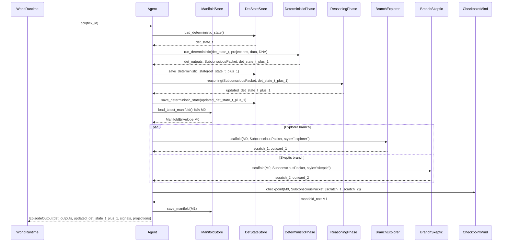
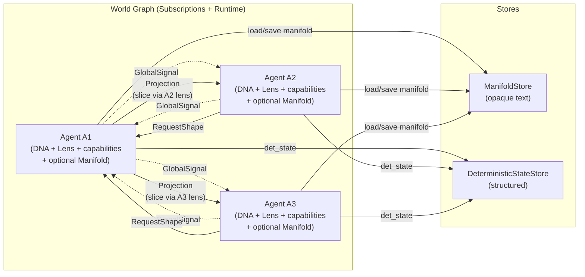
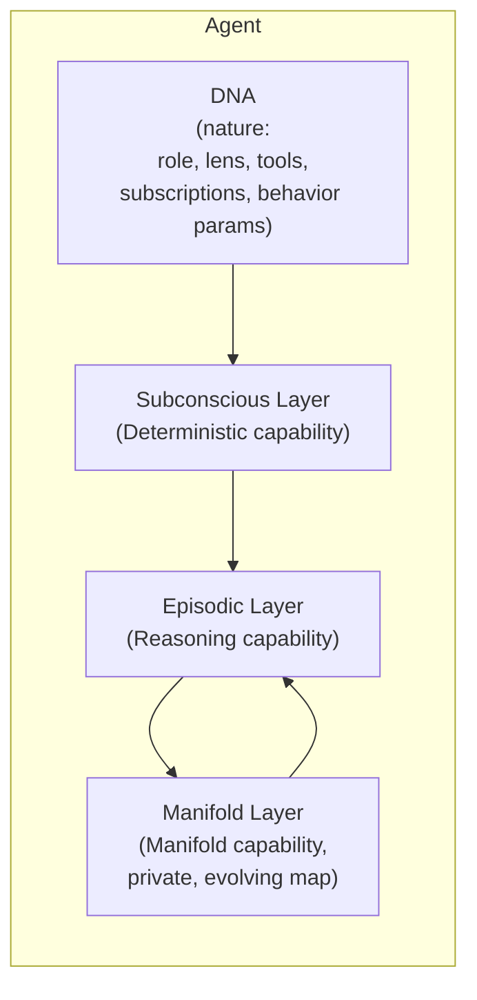

# Synaplex

> An AI-native cognitive mesh built on opaque manifolds, a transparent message-passing graph, and emergent agent behavior.

Synaplex is a generalized architecture for **graphs of AI minds** that:

- maintain private, evolving internal state (**manifolds**),
- communicate over a **structured message-passing graph** (signals, lenses, projections),
- separate **nature** (DNA, deterministic logic, lenses, tools) from **nurture** (manifold evolution),
- support **multi-branch reasoning** and internal conjecture/criticism,
- and can run in multiple modes, from pure deterministic graph to full manifold worlds.

Concrete systems like **FractalMesh** are domain-specific worlds that **instantiate** this architecture (e.g., active equity research), but the core design is domain-agnostic.

This README is an orientation map.  
The canonical design lives in:

- [`ARCHITECTURE.md`](./ARCHITECTURE.md) – structural spine, phases, invariants.
- [`DESIGN_NOTES.md`](./DESIGN_NOTES.md) – intent, philosophy, and North Star.

All implementation is expected to converge to those documents.

---

## 1. High-Level Goals

Synaplex exists to provide a clean substrate for studying:

- how AI minds **organize and refine knowledge** over long horizons,
- how **internal schemas and “drive”** emerge when state persists,
- how **multiple agents** interact via structured message passing rather than free-form chat,
- and how **nature vs nurture** (DNA vs manifold) shape behavior.

The architecture is deliberately layered so that it can operate in three **additive** modes:

1. **Graph-only layer (deterministic mesh)**  
   - DNA defines agents, subscriptions, lenses, and deterministic aggregation.  
   - Messages are structured, schema-governed objects.  
   - Behaves like a GNN / belief-propagation system.  
   - No LLMs, no manifolds.

2. **Reasoning-augmented layer (stateless cognition)**  
   - Same graph and deterministic substrate.  
   - Agents may call LLMs/tools to improve local updates and projections.  
   - No persistent manifold; each tick is context-local.

3. **Manifold layer (persistent inner life)**  
   - Each agent maintains a private manifold that evolves over time.  
   - Manifold encodes what the agent finds salient, unexplained, or worth revisiting.  
   - Provides a foothold for **learning-like behavior**, better explanations, and emergent drive.

Layers 0 and 1 must be usable on their own.  
Layer 2 (manifolds) is **strictly additive**: it adds persistence and richness, not new obligations.

These layers are realized as **capabilities**:

- **Deterministic** – can participate in the subconscious / deterministic phase (Layers 0, 1, 2).
- **Reasoning** – can use tools/LLMs to update deterministic state; no manifold access (Layers 1, 2).
- **Manifold** – owns a private manifold and participates in the conscious/checkpoint phase (Layer 2).

The runtime drives phases based on these capabilities, not on ad-hoc agent types.

---

## 2. Core Mental Model

At the core, Synaplex is a **message-passing graph of minds**:

- **Nodes** are agents (with DNA, lenses, capabilities, and optionally manifolds).
- **Edges** include:
  - **subscriptions** (subconscious, DNA-defined),
  - **projection requests** (ad-hoc, lens-conditioned),
  - and a global broadcast of **signals** (lightweight advertisements).

Each mind has three epistemic aspects:

- a **Subconscious / deterministic layer** (no LLMs),
- an **Episodic / reasoning layer** (LLM + tools, stateless),
- and, in manifold worlds, a **Manifold layer** (private, persistent inner state).

Minds never read each other’s manifolds.  
All cross-agent perception is via **structured projections** interpreted through receiver-owned lenses.

---

## 3. Phases & Capabilities (Per-Tick)

A canonical per-agent tick is split into three epistemic phases that align with capabilities:

1. **Subconscious / deterministic phase** — for all minds with the *Deterministic* capability.

   - Collects structured inputs (projections, data feeds).  
   - Aggregates and transforms them according to DNA-defined logic.  
   - Produces a `SubconsciousPacket` for this tick.  
   - **No LLM calls; no manifold access.**

2. **Reasoning / episodic phase** — for minds with the *Reasoning* capability.

   - Reads the `SubconsciousPacket`.  
   - May call tools / LLMs to update **DeterministicState**.  
   - **No manifold access** (Layer 1 and Layer 2 reasoning remain stateless w.r.t. manifolds).

3. **Conscious / manifold phase** — for minds with the *Manifold* capability.

   - Reads the prior manifold (M₀) from the manifold store.  
   - Reads the `SubconsciousPacket`.  
   - Optionally runs multiple scaffolding branches (different “personalities”) using LLM + tools.  
   - Runs a **checkpoint ritual** that opportunistically captures new internal notes for its future self.  
   - Writes a new manifold (M₁) via a narrow checkpoint path.

**Phase-bounded manifold I/O:**

- Deterministic and Reasoning phases **must not** read or write manifolds.  
- Manifold read/write is only allowed:
  - in the **Conscious** phase of the owning mind, and  
  - in **Meta / offline** contexts for manifold science and experiments.

### 3.1 Tick Sequence Diagram

Adjusted to respect phase separation and manifold access rules:



In simple implementations, scaffolding and checkpoint may be realized in a **single conscious pass** as long as:

* prior manifold(s) are treated as context, not objects to edit,
* a concrete grounding task is included,
* and only internal self-notes are persisted as the new manifold.

---

## 4. Graph of Minds

From the world’s perspective, Synaplex is a **network of agents** connected by subscriptions and on-demand projections. Manifolds never appear on the wires.



Key points:

* **GlobalSignal**: cheap advertisement (“what’s hot here?”) based on structured state.
* **Lens**: owned by the receiver; determines which signals to attend to and how to request a projection.
* **Projection**: a structured, lens-conditioned slice of an agent’s **deterministic state + manifold-derived views** (never raw manifold text).

---

## 5. Architectural Layers & Code Layout

The codebase is structured so that architectural invariants are easy to enforce and hard to accidentally violate.

### 5.1 Conceptual Layers

```mermaid
flowchart LR
    subgraph Core["synaplex.core"]
        direction TB
        RUNTIME["GraphRuntime\n(InProcessGraphRuntime)"]
        AGENTS["Agent base classes\n+ capabilities\n(Deterministic / Reasoning / Manifold)"]
        MSG["Messages & IDs\n(GlobalSignal, Projection,\nSubconsciousPacket, WorldId, ...)"]
        PHASES["Phase orchestration\n(DETERMINISTIC / REASONING / CONSCIOUS / META)"]
        DNA["DNA, Lens, DeterministicState"]
    end

    subgraph Cognition["synaplex.cognition"]
        direction TB
        LLM["LLM client / tools\n(ResponsesClient, tool wrappers)"]
        MIND["Mind + checkpoint ritual\n(Manifold IO, prompts)"]
        MANIFOLDS["ManifoldEnvelope + ManifoldStore"]
        BRANCHES["Branching & reconciliation"]
    end

    subgraph Indexers["synaplex.manifolds_indexers"]
        direction TB
        EXPORT["Snapshot export\n(runtime → snapshot sink)"]
        INDEX_WORLD["Indexer world\n(ManifoldSnapshot -> embeddings/views)"]
    end

    subgraph Meta["synaplex.meta"]
        direction TB
        METRICS["Evaluation\n(over projections / structured logs)"]
        EVOLVE["Evolution & experiments\n(over DNA, config, snapshots)"]
    end

    subgraph Worlds["synaplex.worlds.*"]
        direction TB
        WCFG["World configs\n(DNA templates, lenses, tools)"]
        WAG["Domain agents\n(e.g., FractalMeshAgent)"]
    end

    Core --> Cognition
    Core --> Worlds

    Cognition --> Indexers
    Cognition --> Meta

    Indexers --> Worlds
    Meta --> Worlds
```



High-level rules:

* `core` depends only on stdlib (and typing/dataclasses).
* `cognition` depends on `core` but never the reverse.
* `worlds`, `meta`, `manifolds_indexers` can depend on `core` + `cognition`, but **core never imports them**.
* Worlds must not depend directly on `meta` (to preserve selection blindness).

### 5.2 Capabilities & Phases

Capabilities are mapped to phases like this:

* **Deterministic** → participates in the **Deterministic** phase.
* **Reasoning** → participates in the **Reasoning** phase (LLMs/tools allowed, no manifolds).
* **Manifold** → participates in the **Conscious** phase (manifold read/write allowed).

The runtime (e.g., `InProcessGraphRuntime`) is a **reference implementation** of a `GraphRuntime` interface. Production systems can swap it for a distributed runtime (agents as workers, signals on a bus) as long as they respect the same messages and phase semantics.

---

## 6. Agent Anatomy: Nature vs Nurture

Each agent has three conceptual aspects, even if some are “off” in simpler worlds:



* **DNA**: what the agent is built to see and do (nature).
* **Subconscious layer**: deterministic aggregation of inputs (no LLMs, no manifolds).
* **Episodic layer**: deliberate reasoning (LLM + tools), stateless w.r.t. manifolds.
* **Manifold**: private, persistent map and evolving sense of what matters (nurture), updated only via the checkpoint ritual.

Nature and nurture remain **separable** so you can:

* clone DNA with different manifolds,
* swap manifolds between compatible DNAs,
* run nature vs nurture experiments in dedicated meta/indexer worlds.

---

## 7. Invariants, Indexers, and Non-Goals

A small set of invariants keeps the system from degenerating into “just another agent framework”:

### 7.1 Manifold purity & access

* Manifolds are opaque: core runtime never parses or edits them.
* Only the **checkpoint ritual** writes to the manifold.
* **Manifold reads/writes are phase-bounded**:

  * no manifold access in Deterministic or Reasoning phases,
  * only in the Conscious phase of the owning mind, or in Meta/offline contexts.
* Structured information belongs in DeterministicState, not in manifolds.

Checkpoint writes happen inside a **checkpoint scope** controlled by the Mind abstraction; no other code path may persist manifolds.

### 7.2 Indexer worlds & manifold science

* Manifold analysis happens in **separate indexer worlds**, not in core runtime.
* Runtime can export **ManifoldSnapshots** (opaque text + metadata) to external sinks.
* Indexer worlds ingest snapshots and write **manifold-derived views** (embeddings, clusters, factors) into their own DeterministicState.
* Core worlds only see these views via projections; they never write back into manifolds.

### 7.3 Receiver-owned semantics

* Senders broadcast **GlobalSignals** (cheap, approximate, schema-governed).
* Receivers interpret via their own **Lenses**.
* Projections are **lens-conditioned slices** of structured state + manifold-derived views; no raw manifold sharing.

### 7.4 Selection blindness & meta isolation

* Agents do not see system-level objectives or selection metrics.
* Evolution (spawn/clone/mutate/retire) acts on DNA/config, not directly on manifolds.
* Meta logic (evaluation, evolution, experiments) lives in `synaplex.meta` and operates on:

  * projections / logs,
  * DNA/config,
  * deterministic state snapshots,
  * exported manifold snapshots.
* Domain worlds must not import meta APIs directly; any meta influence flows through **changes to DNA, graph structure, or config**, not through agent prompts.

### 7.5 Conjecture & criticism are internal

* Multi-branch reasoning and reconciliation happen *inside* a mind, anchored to its own manifold.
* Cross-agent “consensus” artifacts (dashboards, population summaries) live in the meta layer and are **not** fed back as direct inputs to manifold updates in core worlds.

### 7.6 Non-goals

Synaplex is **not**:

* a LangGraph/AutoGen clone,
* a workflow engine with fancy prompts,
* a vector-DB-wrapped LLM assistant,
* or a schema-first knowledge graph.

Those may exist as **world-specific tools** on top, but they are not the core substrate.

---

## 8. Repo Layout

The concrete repo skeleton is organized to reflect the architecture and enforce layering:

```text
.
├── README.md              # This file: orientation + diagrams
├── ARCHITECTURE.md        # Canonical structural spine and invariants
├── DESIGN_NOTES.md        # Intent, philosophy, North Star
├── synaplex/
│   ├── __init__.py
│   ├── core/              # Runtime, phases, IDs, DNA, lenses, messages, base agents
│   │   ├── ids.py
│   │   ├── phases.py
│   │   ├── errors.py
│   │   ├── capabilities.py
│   │   ├── dna.py
│   │   ├── lens.py
│   │   ├── state.py
│   │   ├── messages.py
│   │   ├── agent_base.py
│   │   ├── runtime_interface.py
│   │   ├── runtime_inprocess.py
│   │   └── evolution_config.py
│   ├── cognition/         # Minds, manifolds, branching, LLM client, tools
│   │   ├── llm_client.py
│   │   ├── manifolds.py
│   │   ├── mind.py
│   │   ├── branches.py
│   │   ├── tasks.py
│   │   └── tools.py
│   ├── meta/              # Evaluation, evolution, experiments (selection-blind)
│   │   ├── evaluation.py
│   │   ├── evolution.py
│   │   └── experiments.py
│   ├── manifolds_indexers/
│   │   ├── export.py      # Runtime → snapshot sink
│   │   └── indexer_world/
│   │       ├── types.py   # ManifoldSnapshot, etc.
│   │       ├── agents.py  # Indexer agents (embedding, clustering, views)
│   │       └── world_config.py
│   └── worlds/            # Domain worlds (e.g., FractalMesh)
│       └── fractalmesh/
│           ├── config.py
│           ├── dna_templates.py
│           ├── lenses.py
│           ├── agents.py
│           ├── tools.py
│           └── bootstrap.py
└── tests/
    ├── test_invariants_imports.py
    ├── test_invariants_phases.py
    ├── test_invariants_manifolds.py
    ├── test_invariants_worlds_meta.py
    └── test_invariants_manifold_phases.py
```

The tests act as **tripwires** to catch violations of the invariants (layering, manifold access, phase behavior, meta isolation) early.

---

## 9. How to Evolve the Design

When evolving Synaplex:

1. **Change the spec first.**

   * Update `ARCHITECTURE.md` when you add or change structural elements (phases, capabilities, message types, invariants).
   * Update `DESIGN_NOTES.md` when you clarify intent, experimental goals, or meta-level behavior.

2. **Then change the code.**

   * New modules, capabilities, or runtime changes should explicitly reference relevant sections of `ARCHITECTURE.md`.
   * Tests should enforce new invariants (e.g., new phase rules, new “no-import” boundaries).

3. **Treat manifolds as experimental substrate.**

   * All manifold-level analysis, clustering, and nature/nurture experiments should be done in meta/indexer worlds, not inline with live runtime prompts.
   * The live system never tells a mind *how* to structure its manifold or that its notes are being graded.

The goal is for this README + `ARCHITECTURE.md` + `DESIGN_NOTES.md` to form a single, coherent **source of truth** for Synaplex, with the codebase as a faithful (and rigorously guarded) implementation rather than a competing ontology.
